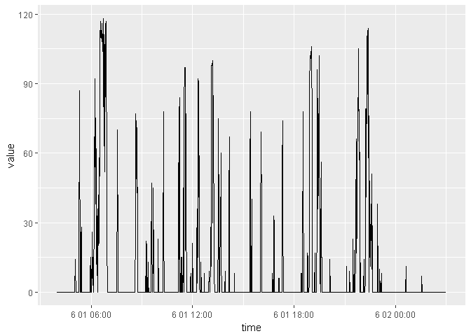
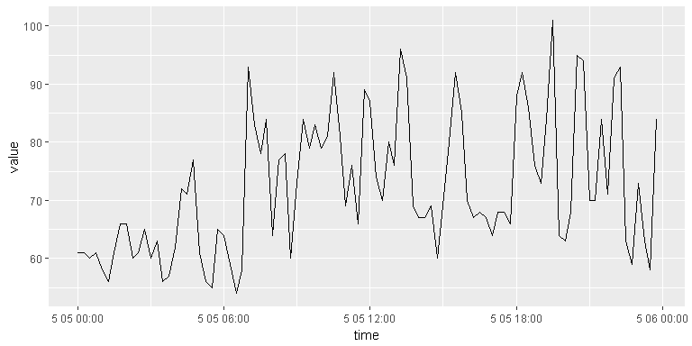

<!-- README.md is generated from README.Rmd. Please edit that file -->
fitbitr
=======

 [](http://cran.rstudio.com/web/packages/fitbitr) 

`fitbitr` package allows users to interact with Fitbit data in R using Fitbit API.

This package allows for most of the read and write methods that you might want to use.

Installation
------------

fitbitr isn't available from CRAN yet, but you can get it from github with:

``` r
# install.packages("devtools")
devtools::install_github("teramonagi/fitbitr")
```

Preparation
-----------

### API key

To get your own token (API key), you have to register your own application in [here](https://dev.fitbit.com/apps/new). For your reference, we share our setting:


After registration, you can get your own `FITBIT_KEY` and `FITBIT_SECRET` (referred to as **OAuth 2.0 Client ID** and **Client Secret** in the next figure).


If you set the following variables as a global variable, this package will use these values for API key.

``` r
# As a global variable
FITBIT_KEY    <- "<your-fitbit-key>"
FITBIT_SECRET <- "<your-firbit-secret>"
# If you want, Default: "http://localhost:1410/"
# FITBIT_CALLBACK <- "<your-fitbit-callback>" 
```

Or, you can set these values as a environment variable

``` r
Sys.setenv(FITBIT_KEY = "<your-fitbit-key>", FITBIT_SECRET = "<your-firbit-secret>")
```

### Load libraries

``` r
library("fitbitr")
library("ggplot2") # for visualization in this document
```

### Get Fitbit API token

You can get your Fitbit toekn using `fitbitr::oauth_token()`:

``` r
# Get token
token <- fitbitr::oauth_token()
```

This function open a web browser autmatically and return Fitbit token.

How to use
----------

### Activity

``` r
# Example date
date <- "2017-12-29"

# Get daily activity summary
str(get_activity_summary(token, date))
#> List of 3
#>  $ activities: list()
#>  $ goals     :List of 5
#>   ..$ activeMinutes: int 30
#>   ..$ caloriesOut  : int 2790
#>   ..$ distance     : num 8.05
#>   ..$ floors       : int 10
#>   ..$ steps        : int 10000
#>  $ summary   :List of 15
#>   ..$ activeScore         : int -1
#>   ..$ activityCalories    : int 2563
#>   ..$ caloriesBMR         : int 1732
#>   ..$ caloriesOut         : int 4031
#>   ..$ distances           :'data.frame': 7 obs. of  2 variables:
#>   .. ..$ activity: chr [1:7] "total" "tracker" "loggedActivities" "veryActive" ...
#>   .. ..$ distance: num [1:7] 14.33 14.33 0 9.72 1.11 ...
#>   ..$ elevation           : int 0
#>   ..$ fairlyActiveMinutes : int 67
#>   ..$ floors              : int 0
#>   ..$ heartRateZones      :'data.frame': 4 obs. of  5 variables:
#>   .. ..$ caloriesOut: num [1:4] 1905 1320 132 651
#>   .. ..$ max        : int [1:4] 92 128 156 220
#>   .. ..$ min        : int [1:4] 30 92 128 156
#>   .. ..$ minutes    : int [1:4] 1163 217 12 42
#>   .. ..$ name       : chr [1:4] "範囲外" "脂肪燃焼" "有酸素運動" "ピーク"
#>   ..$ lightlyActiveMinutes: int 186
#>   ..$ marginalCalories    : int 1825
#>   ..$ restingHeartRate    : int 58
#>   ..$ sedentaryMinutes    : int 724
#>   ..$ steps               : int 17394
#>   ..$ veryActiveMinutes   : int 114

# Get Activity Time Series
get_activity_time_series(token, "steps", date=date, period="7d")
#>     dateTime value
#> 1 2017-12-23 14310
#> 2 2017-12-24 16136
#> 3 2017-12-25 18147
#> 4 2017-12-26 10815
#> 5 2017-12-27 11003
#> 6 2017-12-28 21025
#> 7 2017-12-29 17394

# Get activity intraday time series
# You have to use a **personal** key and secret.
df <- get_activity_intraday_time_series(token, "steps", date, detail_level="15min")
df$time <- as.POSIXct(strptime(paste0(df$dateTime, " ", df$dataset_time), "%Y-%m-%d %H:%M:%S"))
ggplot2::ggplot(df, aes(x=time, y=dataset_value)) + geom_line()
```



``` r

# Get Activity Types (complicated nested list)
length(get_activity_types(token))
#> [1] 1

# Get Activity Type (Yoga=52001)
get_activity_type(token, 52001)
#>   accessLevel hasSpeed    id mets name
#> 1      PUBLIC    FALSE 52001  4.3 Yoga

# Get Frequent Activities
get_frequent_activities(token)
#>   activityId calories                                    description
#> 1      90013        0 Walking less than 2 mph, strolling very slowly
#> 2      90009        0                  Running - 5 mph (12 min/mile)
#> 3       1071        0                                               
#> 4      15000        0                                               
#> 5      20047        0                                               
#> 6       3001        0                                               
#>   distance duration            name
#> 1        0  1485000            Walk
#> 2        0  3789000             Run
#> 3        0  1126000    Outdoor Bike
#> 4        0  2560000           Sport
#> 5        0  2560000      Elliptical
#> 6        0  2253000 Aerobic Workout

# Get Recent Activities
get_recent_activity_types(token)
#>   activityId calories                                    description
#> 1      90009        0                  Running - 5 mph (12 min/mile)
#> 2       1071        0                                               
#> 3      90013        0 Walking less than 2 mph, strolling very slowly
#> 4      15000        0                                               
#> 5      20047        0                                               
#>   distance duration         name
#> 1        0  3789000          Run
#> 2        0  1126000 Outdoor Bike
#> 3        0  1485000         Walk
#> 4        0  2560000        Sport
#> 5        0  2560000   Elliptical

# Add, get and delete favorite activities
add_favorite_activity(token, 52001)
get_favorite_activities(token)
#>   activityId description mets name
#> 1      52001              4.3 Yoga
delete_favorite_activity(token, 52001)
get_favorite_activities(token)
#> list()

get_activity_goals(token, period="daily")
#>   activeMinutes caloriesOut distance floors  steps
#> 1            30        2790     10.3     10 100000
update_activity_goals(token, period="daily", distance=10.3)
#>   activeMinutes caloriesOut distance floors  steps
#> 1            30        2790     10.3     10 100000
get_activity_goals(token, period="daily")
#>   activeMinutes caloriesOut distance floors  steps
#> 1            30        2790     10.3     10 100000
get_activity_goals(token, period="weekly")
#>   distance floors  steps
#> 1    56.33     70 100000
update_activity_goals(token, period="weekly", steps="100000")
#>   distance floors  steps
#> 1    56.33     70 100000
get_activity_goals(token, period="weekly")
#>   distance floors  steps
#> 1    56.33     70 100000

# Get Lifetime Stats
get_lifetime_stats(token)
#>   total_distance_date total_distance_value total_floors_date
#> 1          2017-12-17             199.3834        2016-04-17
#>   total_floors_value tracker_distance_date tracker_distance_value
#> 1                 36            2017-12-17               199.3834
#>   tracker_floors_date tracker_floors_value total_activeScore
#> 1          2016-04-17                   36                -1
#>   total_caloriesOut total_distance total_floors total_steps
#> 1                -1        6869.16         4737     8876257
#>   tracker_activeScore tracker_caloriesOut tracker_distance tracker_floors
#> 1                  -1                  -1          6869.16           4737
#>   tracker_steps
#> 1       8876257
```

You can find more details in [here](https://dev.fitbit.com/docs/activity/)

### Heart Rate

``` r
# Set a date for example
date <- "2016-04-01"
# Get heart rate time series
df <- get_heart_rate_time_series(token, date=date, period="7d")
#> Warning in bind_rows_(x, .id): binding factor and character vector,
#> coercing into character vector
#> Warning in bind_rows_(x, .id): binding character and factor vector,
#> coercing into character vector
ggplot(df, aes(x=date, y=peak_max)) + geom_line()
```


``` r
# Get intraday heart rate time series
df <- get_heart_rate_intraday_time_series(token, date=date, detail_level="15min")
ggplot(df, aes(x=time, y=value)) + geom_line()
```



You can find more details [here](https://dev.fitbit.com/docs/heart-rate/).

### Sleep

``` r
# Get Sleep Logs(date is character or Date)
x <- get_sleep_logs(token, "2016-03-30")
print(head(x$sleep))
#>   awakeCount awakeDuration awakeningsCount dateOfSleep duration efficiency
#> 1          0             0              14  2016-03-30 21420000         55
#> 2          0             0              14  2016-03-30 21420000         55
#> 3          0             0              14  2016-03-30 21420000         55
#> 4          0             0              14  2016-03-30 21420000         55
#> 5          0             0              14  2016-03-30 21420000         55
#> 6          0             0              14  2016-03-30 21420000         55
#>                   endTime isMainSleep       logId minutesAfterWakeup
#> 1 2016-03-30T04:06:30.000        TRUE 11255066551                  0
#> 2 2016-03-30T04:06:30.000        TRUE 11255066551                  0
#> 3 2016-03-30T04:06:30.000        TRUE 11255066551                  0
#> 4 2016-03-30T04:06:30.000        TRUE 11255066551                  0
#> 5 2016-03-30T04:06:30.000        TRUE 11255066551                  0
#> 6 2016-03-30T04:06:30.000        TRUE 11255066551                  0
#>   minutesAsleep minutesAwake minutesToFallAsleep restlessCount
#> 1           197          160                   0            14
#> 2           197          160                   0            14
#> 3           197          160                   0            14
#> 4           197          160                   0            14
#> 5           197          160                   0            14
#> 6           197          160                   0            14
#>   restlessDuration           startTime timeInBed            dateTime value
#> 1              160 2016-03-29 22:09:30       357 2016-03-30 22:09:30     1
#> 2              160 2016-03-29 22:09:30       357 2016-03-30 22:10:30     2
#> 3              160 2016-03-29 22:09:30       357 2016-03-30 22:11:30     1
#> 4              160 2016-03-29 22:09:30       357 2016-03-30 22:12:30     1
#> 5              160 2016-03-29 22:09:30       357 2016-03-30 22:13:30     1
#> 6              160 2016-03-29 22:09:30       357 2016-03-30 22:14:30     2
x$summary
#>   totalMinutesAsleep totalSleepRecords totalTimeInBed
#> 1                197                 1            357

#Get the current sleep goal.
get_sleep_goal(token)
#>   awakeRestlessPercentage flowId recommendedSleepGoal typicalDuration
#> 1               0.5631363      0                  465             444
#>   typicalWakeupTime minDuration           updatedOn
#> 1             07:33         380 2017-12-16 10:50:32
#Update sleep goal
update_sleep_goal(token, 380)
#>   minDuration           updatedOn
#> 1         380 2018-01-02 09:24:51

#Get Sleep Time Series
get_sleep_time_series(token, "timeInBed", date="2016-04-02", period="7d")
#>     dateTime value
#> 1 2016-03-27     0
#> 2 2016-03-28     0
#> 3 2016-03-29   714
#> 4 2016-03-30   357
#> 5 2016-03-31   552
#> 6 2016-04-01   326
#> 7 2016-04-02   434
get_sleep_time_series(token, "efficiency", base_date="2016-03-30", end_date="2016-03-30")
#>     dateTime value
#> 1 2016-03-30    55

#Log sleep
log <- log_sleep(token, "22:00", 180, date="2010-04-18")
print(head(log))
#>   awakeCount awakeDuration awakeningsCount dateOfSleep duration efficiency
#> 1          0             0               0  2010-04-19 10800000        100
#> 2          0             0               0  2010-04-19 10800000        100
#> 3          0             0               0  2010-04-19 10800000        100
#> 4          0             0               0  2010-04-19 10800000        100
#> 5          0             0               0  2010-04-19 10800000        100
#> 6          0             0               0  2010-04-19 10800000        100
#>                   endTime isMainSleep       logId minuteData.dateTime
#> 1 2010-04-19T01:00:00.000       FALSE 16704153715            22:00:00
#> 2 2010-04-19T01:00:00.000       FALSE 16704153715            22:01:00
#> 3 2010-04-19T01:00:00.000       FALSE 16704153715            22:02:00
#> 4 2010-04-19T01:00:00.000       FALSE 16704153715            22:03:00
#> 5 2010-04-19T01:00:00.000       FALSE 16704153715            22:04:00
#> 6 2010-04-19T01:00:00.000       FALSE 16704153715            22:05:00
#>   minuteData.value minutesAfterWakeup minutesAsleep minutesAwake
#> 1                1                  0           180            0
#> 2                1                  0           180            0
#> 3                1                  0           180            0
#> 4                1                  0           180            0
#> 5                1                  0           180            0
#> 6                1                  0           180            0
#>   minutesToFallAsleep restlessCount restlessDuration
#> 1                   0             0                0
#> 2                   0             0                0
#> 3                   0             0                0
#> 4                   0             0                0
#> 5                   0             0                0
#> 6                   0             0                0
#>                 startTime timeInBed
#> 1 2010-04-18T22:00:00.000       180
#> 2 2010-04-18T22:00:00.000       180
#> 3 2010-04-18T22:00:00.000       180
#> 4 2010-04-18T22:00:00.000       180
#> 5 2010-04-18T22:00:00.000       180
#> 6 2010-04-18T22:00:00.000       180

#Delete sleep log
delete_sleep_log(token, log$logId)
```

You can find more details [here](https://dev.fitbit.com/docs/sleep/).

### Devices

``` r
# Get deice information you registerd
get_devices(token)
#>   battery deviceVersion features        id        lastSyncTime
#> 1  Medium       Alta HR     NULL 424040354 2017-12-31 11:22:51
#>            mac    type
#> 1 9F1F7466C3DA TRACKER
```

``` r
# Add alarms
tracker_id <- get_devices(token)$id[1]
add_alarm(token, tracker_id, "07:15-08:00", "MONDAY")
#>     alarmId deleted enabled recurring snoozeCount snoozeLength
#> 1 562558099   FALSE    TRUE     FALSE           3            9
#>   syncedToDevice        time    vibe weekDays
#> 1          FALSE 00:15+09:00 DEFAULT
alarm <- get_alarms(token, tracker_id)
alarm
#>     alarmId deleted enabled recurring snoozeCount snoozeLength
#> 1 471178121   FALSE   FALSE      TRUE           3            9
#> 2 562558099   FALSE    TRUE     FALSE           3            9
#>   syncedToDevice        time    vibe
#> 1           TRUE 05:03+09:00 DEFAULT
#> 2          FALSE 00:15+09:00 DEFAULT
#>                                       weekDays
#> 1 MONDAY, TUESDAY, WEDNESDAY, THURSDAY, FRIDAY
#> 2
```

``` r
# Update the content alarm
alarm_id <- tail(alarm, 1)$alarmId
update_alarm(token, tracker_id, alarm_id, "02:15-03:00", "FRIDAY")
#>     alarmId deleted enabled recurring snoozeCount snoozeLength
#> 1 562558099   FALSE    TRUE     FALSE           9            3
#>   syncedToDevice        time    vibe weekDays
#> 1          FALSE 14:15+09:00 DEFAULT
get_alarms(token, tracker_id)
#>     alarmId deleted enabled recurring snoozeCount snoozeLength
#> 1 471178121   FALSE   FALSE      TRUE           3            9
#> 2 562558099   FALSE    TRUE     FALSE           9            3
#>   syncedToDevice        time    vibe
#> 1           TRUE 05:03+09:00 DEFAULT
#> 2          FALSE 14:15+09:00 DEFAULT
#>                                       weekDays
#> 1 MONDAY, TUESDAY, WEDNESDAY, THURSDAY, FRIDAY
#> 2
```

``` r
# Delete alarm you registered here
delete_alarm(token, tracker_id, alarm_id)
#> Response [https://api.fitbit.com/1/user/-/devices/tracker/424040354/alarms/562558099.json]
#>   Date: 2018-01-02 09:24
#>   Status: 204
#>   Content-Type: application/json;charset=UTF-8
#> <EMPTY BODY>
get_alarms(token, tracker_id)
#>     alarmId deleted enabled recurring snoozeCount snoozeLength
#> 1 471178121   FALSE   FALSE      TRUE           3            9
#>   syncedToDevice        time    vibe
#> 1           TRUE 05:03+09:00 DEFAULT
#>                                       weekDays
#> 1 MONDAY, TUESDAY, WEDNESDAY, THURSDAY, FRIDAY
```

You can find more details [here](https://dev.fitbit.com/docs/devices/).

Contributing
------------

-   Fork it ( <https://github.com/teramonagi/fitbitr/fork> )
-   Create your feature branch (git checkout -b my-new-feature)
-   Commit your changes (git commit -am 'Add some feature')
-   Push to the branch (git push origin my-new-feature)
-   Create a new Pull Request

Acknowledgements
----------------

Many thanks to Mr.dichika since This package is based on the extension of [myFitbit package](https://github.com/dichika/myFitbit).

<!--
Future implementation
### Food Logging
You can find more details [here](https://dev.fitbit.com/docs/food-logging/).
### Friends
You can find more details [here](https://dev.fitbit.com/docs/friends/).

### Subscriptions
- https://dev.fitbit.com/docs/subscriptions/

### User
- https://dev.fitbit.com/docs/user/
### Body & Weight
You can find more details in [here](https://dev.fitbit.com/docs/body/)

-->
